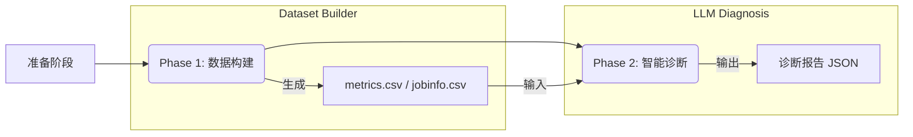

# HPC 异常诊断实验平台 (HPC Anomaly Diagnosis Experiment Platform)

这是一个用于在 HPC 环境中模拟故障、采集数据并利用大语言模型 (LLM) 进行异常诊断的实验平台。该项目旨在构建从故障注入、数据监控到智能分析的完整闭环。

## 目录结构

```
.
├── dataset_builder/       # [Phase 1] 数据构建模块
│   ├── config/            # 实验配置文件 (chaos, metrics, workloads)
│   ├── src/               # 核心逻辑 (chaos.py, monitor.py, workload.py)
│   ├── data/              # 生成的实验数据 (metrics.csv, jobinfo.csv)
│   └── run.py             # 数据构建模块运行入口
├── llm/                   # [Phase 2] 智能诊断模块
│   ├── src/               # 分析逻辑 (main.py, run.py)
│   ├── ref/               # Prompt模板和Few-shot示例
│   ├── data/              # LLM生成的诊断报告
│   └── run.py             # 智能诊断模块运行入口
├── note/                  # 项目文档与笔记
├── requirements.txt       # Python依赖
└── prerequisites.md       # 外部环境依赖说明
```

## 环境准备

本实验依赖复杂的 HPC 基础设施。在开始之前，请务必阅读 [prerequisites.md](prerequisites.md) 确认您的环境满足以下要求：

1.  **Slurm** 作业调度系统
2.  **Prometheus** 监控系统 (含 Node Exporter)
3.  **ChaosBlade** 故障注入工具
4.  **NAS Parallel Benchmarks (NPB)** MPI 版本

### 安装 Python 依赖

```bash
pip install -r requirements.txt
```

### 配置环境变量

复制示例配置文件并填入您的 API Key（用于 LLM 诊断阶段）：

```bash
cp .env.example .env
# 编辑 .env 文件，填入 OPENROUTER_API_KEY
```

## 运行流程与模块配合 (Workflow & Navigation)

本实验由两个紧密配合但物理独立的模块组成。为了顺利复现，请按照以下“导航地图”阅读文档并执行操作。



### Step 0: 环境准备
*   **目标**: 确保 HPC 集群、监控和故障注入工具就绪。
*   **必读文档**: [reproducibility_checklist.md](reproducibility_checklist.md) (复现检查清单)
*   **⚠️ 关键动作**: 
    *   修改 `dataset_builder/config/workloads.yaml` 中的 NPB 路径。
    *   修改 `dataset_builder/config/chaos.yaml` 中的网卡名称 (`ens33` -> `eth0`/other)。
*   **操作**: 安装依赖，配置 `.env`，确认 Prometheus/ChaosBlade 可用。

### Step 1: 数据构建 (DataSet Builder)
*   **目标**: 运行 NPB 基准测试，注入故障，并采集监控数据。
*   **必读文档**: 
    *   [dataset_builder/README.md](dataset_builder/README.md) (核心实验指南)
    *   [dataset_builder/docs/infrastructure_guide.md](dataset_builder/docs/infrastructure_guide.md) (Prometheus & ChaosBlade 深度指南)
*   **操作**: 
    ```bash
    cd dataset_builder
    python run.py --experiment test
    ```
*   **产出**: `dataset_builder/data/test/` 下的数据文件。

### Step 2: 智能诊断 (LLM Diagnosis)
*   **目标**: 利用 LLM 分析 Step 1 生成的数据，定位故障根因。
*   **必读文档**: [llm/README.md](llm/README.md) (诊断逻辑与 Prompt 配置)
*   **操作**:
    ```bash
    cd llm
    python run.py --experiment test
    ```
*   **产出**: `llm/data/test/diagnosis_report.json`。

## 详细运行指南

### 阶段一：数据构建 (DataSet Builder)

该阶段负责提交计算作业，注入故障，并采集监控数据。

1.  进入 `dataset_builder` 目录：
    ```bash
    cd dataset_builder
    ```

2.  运行实验：
    ```bash
    # 运行默认测试实验 (需在 config/experiments.yaml 中定义)
    python run.py --experiment test
    ```

    数据将保存在 `data/test/` 目录下，包含：
    *   `metrics.csv`: 系统性能指标
    *   `jobinfo.csv`: 作业运行状态

    > 详细配置说明请参考 [dataset_builder/README.md](dataset_builder/README.md)

### 阶段二：智能诊断 (LLM Diagnosis)

该阶段利用 LLM 分析阶段一生成的数据，生成诊断报告。

1.  进入 `llm` 目录：
    ```bash
    cd llm
    ```

2.  运行诊断：
    ```bash
    # 分析名为 "test" 的实验数据
    python run.py --experiment test
    ```

    诊断报告将输出到控制台，并保存在 `data/test/` 下。

    > 详细逻辑与 Prompt 配置请参考 [llm/README.md](llm/README.md)

## 高级配置

### 实验配置
在 `dataset_builder/config/experiments.yaml` 中定义新的实验：
*   `workload_plan`: 选择背景负载 (如 `light_background`)
*   `chaos_plan`: 选择故障类型 (如 `cpu_fullload`)
*   `monitoring`: 设置采集频率

### 故障类型
在 `dataset_builder/config/chaos.yaml` 中定义故障参数 (如 CPU 使用率、网络丢包率)。

### 监控指标
在 `dataset_builder/config/metrics.yaml` 中定义 Prometheus 查询语句 (PromQL)。

## 常见问题

**Q: 运行 `blade` 失败？**
A: 请检查 ChaosBlade 是否已安装，且当前用户是否有权限运行 (可能需要 sudo)。

**Q: Prometheus 连接失败？**
A: 请在 `dataset_builder/config/metrics.yaml` 中检查 `prometheus_url` 是否正确，确保防火墙未拦截端口 9090。

**Q: 找不到 NPB 可执行文件？**
A: 请在 `dataset_builder/config/workloads.yaml` 中配置正确的 NPB 安装路径。
